<div align="center">

# 🕵️ Columbo: Root Cause Explorer in Containerized Architectures

> *"Just one more thing..."* — Your investigation partner for containerized systems.

</div>

Columbo is an intelligent root cause exploration engine that helps you investigate failures in containerized environments. Like the famous detective, Columbo asks the right questions and follows the evidence until the mystery is solved.

https://github.com/user-attachments/assets/df5076ad-059b-476d-9e08-ccfcf2bff43a

*Watch Columbo investigate in real-time with the interactive Terminal UI (6x speed)*

## Overview

### 🎬 Origin Story

Columbo was born from a frustrating debugging session right before the holidays. An environment variable override buried in a YAML config file caused a production-like failure that took way too much time to track down through manual container inspection, log diving, and configuration archaeology. Sound familiar?

That bug became scenario `s001_env_override`, and the motivation to build something better.

### 🚧 Project Status

Columbo is just a few days old, a holiday project that solved a real problem. It's functional and tested against real failure scenarios, but comes with a minimal test suite and plenty of rough edges. Contributions are especially welcome!

### 🔍 How It Works

As a lifelong Columbo fan, I've always admired the detective's smart yet humble investigating style: asking simple questions, following evidence methodically, and never making assumptions. "Just one more thing..." wasn't about showing off, it was about systematic, patient investigation until the truth emerged. That's exactly how debugging should work.

Columbo systematically investigates issues in your local containerized environments using hypothesis-driven reasoning. Instead of ad-hoc manual inspection, trial-and-error, or hoping ChatGPT remembers Docker networking, it guides a structured investigation:

1. 💭 **Generating hypotheses** about potential root causes based on available evidence
2. 🎯 **Planning and executing diagnostic probes** to gather targeted evidence
3. 🧠 **Digesting findings** and updating its understanding iteratively
4. ⏱️ **Deciding when to stop** based on evidence quality and explicit confidence criteria
5. 📋 **Producing comprehensive diagnoses** with root causes and recommended fixes

The agent operates entirely through structured probes—deterministic inspection tools that examine container states, logs, configurations, network connectivity, and more. No guessing, no hallucinations, just systematic evidence gathering and reasoning.

## Design Principles

### 🎯 Evidence Over Speculation
Columbo never guesses. Every conclusion must be grounded in actual probe outputs—container states, logs, configurations, network tests. If it wasn't observed, it doesn't exist. This prevents hallucinations and ensures diagnoses are verifiable.

### 🔬 Hypothesis-Driven Reasoning
Each probe is executed to test a specific hypothesis, not for random exploration. Like an experienced engineer, Columbo thinks before it acts: "I suspect X might be wrong, so I'll check Y to confirm." This keeps investigations focused and efficient.

### 📋 Human-First Explainability
Every investigation produces readable reports showing the full reasoning trail—what was checked, why, and what was found. Debugging is collaborative work. Columbo shows its work so teammates can verify findings, learn from the process, and reproduce investigations.

### ✅ Evaluation First
Columbo is built to be tested. Real-world failure scenarios are encoded as reproducible test cases with known root causes. This ensures the agent actually works before you rely on it for production debugging.

## Architecture

```mermaid
%%{init: {'theme':'base', 'themeVariables': { 'primaryColor':'#6366f1','primaryTextColor':'#fff','primaryBorderColor':'#4f46e5','lineColor':'#8b5cf6','secondaryColor':'#a78bfa','tertiaryColor':'#c4b5fd','background':'#faf5ff'}}}%%
flowchart LR
    A["🔍<br/><b>Problem</b>"]
    B["💭<br/><b>Generate<br/>Hypotheses</b>"]
    C["🎯<br/><b>Plan<br/>Probe</b>"]
    D["⚙️<br/><b>Execute<br/>Probe</b>"]
    E["🧠<br/><b>Digest<br/>Evidence</b>"]
    F["📋<br/><b>Diagnosis</b>"]
    
    A --> B
    B --> C
    C --> D
    D --> E
    E -->|"🔄 Continue?"| B
    E -->|"✅ Done"| F
    
    classDef startEnd fill:#10b981,stroke:#059669,stroke-width:3px,color:#fff
    classDef reasoning fill:#6366f1,stroke:#4f46e5,stroke-width:2px,color:#fff
    classDef execution fill:#8b5cf6,stroke:#7c3aed,stroke-width:2px,color:#fff
    
    class A,F startEnd
    class B,C,E reasoning
    class D execution
```



**The Investigation Loop:**
1. **💭 Generate Hypotheses** - LLM proposes what might be wrong based on current evidence
2. **🎯 Plan Probe** - LLM selects the best diagnostic tool to test the hypothesis
3. **⚙️ Execute Probe** - Deterministic inspection of containers, logs, configs, network
4. **🧠 Digest Evidence** - LLM analyzes results and updates understanding
5. **🔄 Repeat or Complete** - Continue until confident or max steps reached

See [ARCHITECTURE.md](docs/ARCHITECTURE.md) for detailed design documentation.

## Diagnostic Capabilities

Columbo inspects your containerized environment across four key areas:

- **Container Inspection** - Status, logs, configuration, ports, mounts, and runtime permissions
- **Volume & File System** - Volume metadata, file contents, and permission analysis  
- **Network Diagnostics** - DNS resolution, TCP/HTTP connectivity testing
- **Configuration Analysis** - Docker Compose files, environment variables, and config parsing

All probes are deterministic, never raise exceptions, and return structured evidence suitable for analysis.

## Example Output

After investigation, Columbo generates comprehensive reports with the diagnosis and full investigation trail:

````markdown
# Debug Session Report: abc123ef

**Session Started:** 2025-12-31 10:15:30 UTC
**Session Ended:** 2025-12-31 10:18:45 UTC
**Total Duration:** 195.2 seconds
**Steps Used:** 3/10

## Initial Problem

Application container fails to connect to backend service.
Connection errors in logs, both containers appear to be running.

## Probes Executed (3)

### Step 1: containers_state
| Container | Status | Healthy |
|-----------|--------|---------|
| app_frontend | running | ✓ |
| app_backend | running | ✓ |
| app_database | running | ✓ |

### Step 2: container_logs
**Container:** app_frontend
```
[ERROR] Failed to connect to backend service
Configuration loaded: backend_host=localhost:8080
Retrying connection... (attempt 5/10)
Connection refused on localhost:8080
```

### Step 3: docker_compose_parsing
**Service configuration:**
- backend service name: `app_backend`
- frontend environment: `BACKEND_HOST=localhost:8080`
- Expected: `BACKEND_HOST=app_backend:8080`

## Diagnosis

The frontend container is configured with BACKEND_HOST=localhost:8080, 
causing it to attempt connections to its own container rather than the 
backend service. The hostname should reference the service name from 
docker-compose for proper container-to-container communication.
````

## Installation

### Prerequisites

- Python 3.11-3.14
- Docker Desktop or Docker Engine running locally
- Poetry for dependency management
- LLM API key (OpenAI, Anthropic, or other DSPy-compatible provider)

### Setup

1. Clone the repository:
```bash
git clone <repository-url>
cd columbo_root_cause_explorer
```

2. Install dependencies using Poetry:
```bash
poetry install
```

3. Configure your LLM API key:
```bash
# Create a .env file
echo "OPENAI_API_KEY=your-api-key-here" > .env

# Or for Anthropic Claude:
echo "ANTHROPIC_API_KEY=your-api-key-here" > .env
```

4. (Optional) Set your preferred LLM model:
```bash
# Add to your .env file
echo "COLUMBO_MODEL=openai/gpt-5-mini" >> .env

# Or use Claude:
echo "COLUMBO_MODEL=anthropic/claude-3-5-sonnet-20241022" >> .env

# Default model if not set: openai/gpt-5-mini
```

## Usage

### Command-Line Interface (Recommended)

The easiest way to use Columbo is via the CLI:

```bash
# Simple usage - describe the problem inline
columbo debug "My app container fails to connect to postgres"

# Load problem description from a file
columbo debug --from-file problem.txt

# Use interactive UI mode for live updates
columbo debug --interactive "Service keeps crashing on startup"

# Use a different LLM model via command line
columbo debug "Network timeout" \
  --model anthropic/claude-3-5-sonnet-20241022

# Or set it via environment variable
export COLUMBO_MODEL=anthropic/claude-3-5-sonnet-20241022
columbo debug "Network timeout"

# Save results to a specific directory
columbo debug "Network timeout" --output-dir ./debug_results
```

After installation with `poetry install`, the `columbo` command becomes available in your environment.

**CLI Options:**
- `--from-file PATH`: Read initial evidence from a text file
- `--workspace PATH`: Path to your project root (default: current directory)
- `--max-steps N`: Maximum debugging steps (default: 8)
- `--interactive`: Enable Rich terminal UI with live updates
- `--model MODEL`: LLM model to use (default: from `COLUMBO_MODEL` env var or `openai/gpt-5-mini`)
- `--output-dir PATH`: Where to save session results (default: ./columbo_sessions)
- `--no-save`: Don't save session results to disk

**Supported Models:**
- Any DSPy-compatible LLM provider

### Interactive UI

The `--interactive` flag launches a rich Terminal UI that shows the investigation in real-time:

- 🔍 **Current Hypothesis** - What Columbo is investigating now
- ⚙️ **Active Probe** - Live probe execution with spinner
- 📊 **Latest Evidence** - Most recent findings
- 📝 **Probe History** - All probes executed this session
- 📈 **Progress** - Step counter and confidence level

## Evaluation & Benchmarking

Columbo includes a comprehensive evaluation framework:

### Running Evaluations

```bash
# Evaluate a single scenario
poetry run python evaluation/evaluate_scenario.py s001_env_override --interactive

# Run all scenarios
for scenario in s001 s002 s003 s004 s005; do
    poetry run python evaluation/evaluate_scenario.py ${scenario}_* --cleanup
done
```

**Available Test Scenarios:**
- `s001_env_override` - Environment variable override by config file (Medium)
- `s002_image_not_rebuilt` - Stale Docker image cache issue (Medium)
- `s003_stale_volume` - Incompatible persistent volume data (Medium)
- `s004_port_blocker` - Port conflict from leftover container (Easy)
- `s005_permission_denied` - Volume permission mismatch (Medium)

See [scenarios/README.md](scenarios/README.md) for detailed scenario descriptions.

### Evaluation Metrics

TO BE COMPLETED

## Contributing

Contributions welcome! Key areas for enhancement:

### New Scenarios

Add evaluation scenarios (`scenarios/sXXX_name/`) to test new bug patterns:
- Timing issues (race conditions, startup ordering)
- Resource exhaustion (OOM, disk space, connection pools)
- Multi-service failures (cascading failures, circular dependencies)
- Configuration complexity (secrets, dynamic configs)
- Security issues (certificates, credential rotation)

Each scenario needs: `manifest.json`, `docker-compose.yml`, app code, and `README.md`

### New Probes

**Process & Resources**: CPU/memory/disk monitoring, process inspection (`ps`, `top`)  
**Application-Specific**: Database checks (PostgreSQL, MySQL), cache inspection (Redis), message queues (Kafka, RabbitMQ)  
**Advanced Debugging**: Tracing (Jaeger), metrics (Prometheus), structured log parsing, profiling

### Guidelines

1. Probes must be deterministic and exception-safe
2. Follow Pydantic patterns for all data structures
3. Scenarios must include expected outcomes
4. Update probe registry and documentation
5. Preserve reasoning/execution separation

See [.github/copilot-instructions.md](.github/copilot-instructions.md) for architectural principles.

## Future Enhancements

### Short Term

**Performance & Efficiency**  
Token usage optimization, latency reduction, streaming responses

**Scenario Coverage**  
Timing issues (race conditions, startup ordering), resource exhaustion (OOM, disk space), multi-service failures, security issues (certificates, secrets)

### Long Term

**Platform Expansion**  
Kubernetes (pods, services, ConfigMaps), Docker Swarm (tasks, overlay networks), Podman (rootless containers, SELinux)

**Observability & Storage**  
Long-term diagnosis database with pattern recognition, investigation history, team-wide knowledge base, correlation with Prometheus/Grafana/Jaeger/ELK

**Advanced Features**  
Multi-cluster debugging, CI/CD integration, chat bots (Slack/Discord), automated remediation with approval, ML-powered anomaly detection

## License

MIT License - See LICENSE file for details

## Acknowledgments

Built with:
- [DSPy](https://github.com/stanfordnlp/dspy) for LLM programming
- [Pydantic](https://pydantic.dev/) for data validation
- [Docker SDK for Python](https://docker-py.readthedocs.io/)