<div align="center">

# 🕵️ Columbo: Root Cause Explorer in Containerized Architectures

> *"Just one more thing..."* — Your investigation partner for containerized systems.

</div>

An intelligent root cause exploration engine that helps you investigate failures in containerized environments. Like the famous detective, Columbo asks the right questions and follows the evidence until the mystery is solved.


*Watch Columbo investigate in real-time with the interactive Terminal UI*

## Overview

**Origin Story:** Columbo was born from a frustrating debugging session right before the holidays. An environment variable override buried in a YAML config file caused a production-like failure that took way too much time to track down through manual container inspection, log diving, and configuration archaeology. Sound familiar?

That bug became scenario `s001_env_override`, and the motivation to build something better.

Columbo systematically investigates issues in your local containerized environments using hypothesis-driven reasoning. Instead of ad-hoc manual inspection, trial-and-error, or hoping ChatGPT remembers Docker networking, it guides a structured investigation:

1. **Generating hypotheses** about potential root causes based on available evidence
2. **Planning and executing diagnostic probes** to gather targeted evidence
3. **Digesting findings** and updating its understanding iteratively
4. **Deciding when to stop** based on evidence quality and explicit confidence criteria
5. **Producing comprehensive diagnoses** with root causes and recommended fixes

The agent operates entirely through structured probes—deterministic inspection tools that examine container states, logs, configurations, network connectivity, and more. No guessing, no hallucinations, just systematic evidence gathering and reasoning.

## Design Principles

### 1. 🎯 Evidence Over Speculation
**The agent never reasons in a vacuum.** Every conclusion must be grounded in explicit, inspectable probe outputs. We reject approaches that allow LLMs to "guess" or "assume" system state. If it wasn't observed through a probe, it doesn't exist.

*Why this matters:* Hallucinations in debugging are catastrophic. A fabricated log line or imagined container state leads to wrong fixes and wasted time.

### 2. 🔬 Hypothesis-Driven Reasoning
**Actions are not exploratory by default; they must be justified by an explicit hypothesis.** Each probe exists to confirm or refute a specific hypothesis, mirroring how experienced engineers debug. Random exploration wastes tokens, time, and obscures the investigation path.

*Why this matters:* The difference between a junior and senior engineer isn't knowledge—it's knowing what to check next. Columbo must think before it acts.

### 3. ⚙️ Deterministic Tooling
**Probes are deterministic, side-effect aware, and never hallucinate.** If a tool can lie, fail silently, or produce inconsistent results, the agent cannot be trusted. Every probe returns structured data or explicit error states—no exceptions raised, no undefined behavior.

*Why this matters:* LLMs are probabilistic; infrastructure must not be. The system's uncertainty budget is already spent on reasoning—tools must be rock-solid.

### 4. ⏱️ Bounded Investigation
**The agent operates under explicit limits.** Step counts, confidence thresholds, and stop conditions are first-class constraints. Knowing when to stop investigating is as important as knowing what to investigate. Infinite loops and runaway investigations are system failures.

*Why this matters:* Autonomy without bounds is recklessness. Real debugging has deadlines, cost constraints, and diminishing returns.

### 5. 🧩 Separation of Reasoning and Execution
**LLMs reason; probes observe.** This separation keeps uncertainty localized and failures understandable. Reasoning modules live in `modules.py`, probes in `probes/`. Never mix inspection logic with inference logic. Never mutate state outside defined update paths.

*Why this matters:* When something goes wrong, we need to know if it's a reasoning failure (wrong hypothesis) or an execution failure (bad probe). Entangled concerns make debugging the debugger impossible.

### 6. 📋 Human-First Explainability
**Every investigation produces structured artifacts** (session state, findings, RCA report) intended for human review—not just machine consumption. Debugging is inherently collaborative. The agent must show its work, justify its reasoning, and produce artifacts that survive beyond the terminal session.

*Why this matters:* A diagnosis without a trace is useless. Teammates need to verify findings, reproduce investigations, and learn from the agent's reasoning process.

### 7. 🛡️ Type Safety as Documentation
**Exploratory reasoning may be unstructured; anything persisted or shared must be typed.** They document data contracts, enforce invariants, and prevent entire classes of bugs. Untyped dictionaries passing between modules are code smells. If data moves between components, it has a schema.

*Why this matters:* In a system where LLMs generate structured output, the schema IS the API contract. Runtime validation catches model drift and prompt regressions immediately.

---

By design, we sacrifice flexibility for reliability, speed for correctness, and cleverness for clarity. If you want a system that "just explores" or "tries things," this isn't it. Columbo is built for systematic, evidence-based root cause analysis, the way debugging should be done.

## Architecture

```mermaid
%%{init: {'theme':'base', 'themeVariables': { 'primaryColor':'#6366f1','primaryTextColor':'#fff','primaryBorderColor':'#4f46e5','lineColor':'#8b5cf6','secondaryColor':'#a78bfa','tertiaryColor':'#c4b5fd','background':'#faf5ff'}}}%%
flowchart LR
    A["🔍<br/><b>Problem</b>"]
    B["💭<br/><b>Generate<br/>Hypotheses</b>"]
    C["🎯<br/><b>Plan<br/>Probe</b>"]
    D["⚙️<br/><b>Execute<br/>Probe</b>"]
    E["🧠<br/><b>Digest<br/>Evidence</b>"]
    F["📋<br/><b>Diagnosis</b>"]
    
    A --> B
    B --> C
    C --> D
    D --> E
    E -->|"🔄 Continue?"| B
    E -->|"✅ Done"| F
    
    classDef startEnd fill:#10b981,stroke:#059669,stroke-width:3px,color:#fff
    classDef reasoning fill:#6366f1,stroke:#4f46e5,stroke-width:2px,color:#fff
    classDef execution fill:#8b5cf6,stroke:#7c3aed,stroke-width:2px,color:#fff
    
    class A,F startEnd
    class B,C,E reasoning
    class D execution
```



**The Investigation Loop:**
1. **💭 Generate Hypotheses** - LLM proposes what might be wrong based on current evidence
2. **🎯 Plan Probe** - LLM selects the best diagnostic tool to test the hypothesis
3. **⚙️ Execute Probe** - Deterministic inspection of containers, logs, configs, network
4. **🧠 Digest Evidence** - LLM analyzes results and updates understanding
5. **🔄 Repeat or Complete** - Continue until confident or max steps reached

See [ARCHITECTURE.md](docs/ARCHITECTURE.md) for detailed design documentation.

## Available Probes

Columbo has access to a comprehensive toolkit of diagnostic probes organized by category:

### Container Inspection
| Probe | Description |
|-------|-------------|
| `containers_state` | Check running/stopped status of all containers |
| `container_inspect` | Detailed inspection including state, exit code, error messages, labels, and config |
| `container_logs` | Retrieve recent logs from a specific container |
| `container_exec` | Execute shell commands inside containers for diagnostics |
| `containers_ports` | Show port mappings and detect port conflicts |
| `container_mounts` | Inspect volume mounts and bind mount configurations |
| `inspect_container_runtime_uid` | Check runtime UID/GID for permission debugging |

### Volume & File System
| Probe | Description |
|-------|-------------|
| `list_volumes` | List all Docker volumes in the system |
| `volume_metadata` | Get detailed volume information (driver, labels, mountpoint) |
| `volume_data_inspection` | List files and directories within a volume |
| `volume_file_read` | Read specific files from volumes |
| `inspect_volume_file_permissions` | Check file ownership and permissions in volumes |

### Network Diagnostics
| Probe | Description |
|-------|-------------|
| `dns_resolution` | Resolve hostnames to IP addresses |
| `tcp_connection` | Test TCP connectivity between containers |
| `http_connection` | Test HTTP/HTTPS endpoints |

### Configuration Analysis
| Probe | Description |
|-------|-------------|
| `config_files_detection` | Discover configuration files (docker-compose.yml, .env, etc.) |
| `docker_compose_parsing` | Parse and analyze docker-compose.yml files |
| `env_files_parsing` | Parse .env files and extract environment variables |
| `generic_config_parsing` | Parse YAML/JSON configuration files |

Each probe is deterministic, never raises exceptions, and returns structured evidence suitable for LLM processing.

## Installation

### Prerequisites

- Python 3.11-3.14
- Docker Desktop or Docker Engine running locally
- Poetry for dependency management
- OpenAI API key (or compatible LLM endpoint)

### Setup

1. Clone the repository:
```bash
git clone <repository-url>
cd columbo_root_cause_explorer
```

2. Install dependencies using Poetry:
```bash
poetry install
```

3. Configure your LLM API key:
```bash
# Create a .env file
echo "OPENAI_API_KEY=your-api-key-here" > .env
```

> **Note**: By default, Columbo uses `gpt-5-mini`. You can configure a different model in the setup code.

## Usage

### Quick Start: Evaluate on Test Scenarios

Columbo comes with 5 test scenarios covering common container debugging issues:

```bash
# Run on a specific scenario with interactive UI
poetry run python evaluate_scenario.py s001_env_override --interactive

# Run with cleanup to remove previous containers/volumes
poetry run python evaluate_scenario.py s002_image_not_rebuilt --cleanup --interactive
```

**Available Scenarios:**
- `s001_env_override` - Environment variable override by config file (Medium)
- `s002_image_not_rebuilt` - Stale Docker image cache issue (Medium)
- `s003_stale_volume` - Incompatible persistent volume data (Medium)
- `s004_port_blocker` - Port conflict from leftover container (Easy)
- `s005_permission_denied` - Volume permission mismatch (Medium)

See [scenarios/README.md](scenarios/README.md) for detailed scenario descriptions.

### Interactive UI Mode

The `--interactive` flag launches a rich Terminal UI that shows the investigation in real-time:

- 🔍 **Current Hypothesis** - What Columbo is investigating now
- ⚙️ **Active Probe** - Live probe execution with spinner
- 📊 **Latest Evidence** - Most recent findings
- 📝 **Probe History** - All probes executed this session
- 📈 **Progress** - Step counter and confidence level

### Custom Debugging Session

You can also use Columbo to debug your own containerized applications:

```python
from columbo.debug_loop import debug_loop
from columbo.session_utils import save_session_to_file, generate_session_report
import dspy

# Configure LLM
lm = dspy.LM("openai/gpt-4o-mini", api_key=your_api_key)
dspy.configure(lm=lm)

# Define your problem
initial_evidence = """
My application container is crashing on startup.
Logs show "Connection refused" to database.
"""

# Run investigation
session = debug_loop(
    initial_problem=initial_evidence,
    workspace_root="/path/to/your/project",
    max_steps=10,
    confidence_threshold="high"
)

# Save results
save_session_to_file(session, "debug_sessions")
generate_session_report(session, "debug_sessions")
```

## Session Structure

Each debugging session is captured in a Pydantic model:

```python
class DebugSession(BaseModel):
    session_id: str
    initial_problem: str
    workspace_root: Optional[str]
    max_steps: int
    probe_history: List[ProbeCall]
    findings_log: List[Finding]
    hypotheses_log: List[Hypothesis]
    root_cause: Optional[RootCause]
    # ... and more
```

This enables:
- Type-safe access to session data
- JSON serialization/deserialization
- Computed fields (e.g., total execution time)
- Validation and constraints

## Configuration

TO BE COMPLETED

### Probe Configuration

To add a new probe:
1. Create the probe function in the appropriate category file (e.g., `probes/container_probes.py`)
2. Register it in `probes/registry.py` in the `probe_registry` dict
3. Add schema documentation in `PROBE_SCHEMAS` (describes args for LLM)
4. Follow the error-handling pattern: return errors as data, never raise exceptions

## Example Output

After investigation, Columbo generates comprehensive reports with the diagnosis and full investigation trail.

### Generated Markdown Report

```markdown
# Debug Session Report: abc123ef

**Session Started:** 2025-12-31 10:15:30 UTC
**Session Ended:** 2025-12-31 10:18:45 UTC
**Total Duration:** 195.2 seconds
**Steps Used:** 3/10

## Initial Problem

Application container fails to connect to backend service.
Connection errors in logs, both containers appear to be running.

## Probes Executed (3)

### Step 1: containers_state
| Container | Status | Healthy |
|-----------|--------|---------|
| app_frontend | running | ✓ |
| app_backend | running | ✓ |
| app_database | running | ✓ |

### Step 2: container_logs
**Container:** app_frontend
```
[ERROR] Failed to connect to backend service
Configuration loaded: backend_host=localhost:8080
Retrying connection... (attempt 5/10)
Connection refused on localhost:8080
```

### Step 3: docker_compose_parsing
**Service configuration:**
- backend service name: `app_backend`
- frontend environment: `BACKEND_HOST=localhost:8080`
- Expected: `BACKEND_HOST=app_backend:8080`

## Diagnosis

The frontend container is configured with BACKEND_HOST=localhost:8080, 
causing it to attempt connections to its own container rather than the 
backend service. The hostname should reference the service name from 
docker-compose for proper container-to-container communication.
```

### Generated Artifacts

Each session produces three files in `evaluation_results/`:
- `debug_session_<id>.json` - Complete session state with all probes and findings
- `report_<id>.md` - Human-readable investigation summary (shown above)
- `evaluation_<id>.json` - Performance metrics and accuracy analysis

## Advanced Features

### Probe Dependency Resolution

The system automatically resolves probe dependencies. For example, `config_file_contents` depends on `config_files_detection`:

```python
PROBE_DEPENDENCIES = {
    "config_file_contents": {
        "requires": "config_files_detection",
        "transform": lambda result: {"found_files": [f["path"] for f in result]}
    }
}
```

### Session Analytics

```python
from columbo.session_utils import analyze_probe_performance

perf = analyze_probe_performance(session_model)
print(f"Total time: {perf['total_time']:.2f}s")
print(f"Success rate: {perf['success_rate']:.1%}")
```

### Signature-Based Deduplication

The agent tracks probe signatures (name + args) to avoid redundant executions:

```python
signature = f"{probe_name}:{json.dumps(probe_args, sort_keys=True)}"
if signature in executed_signatures:
    print("⚠️  Probe already executed, skipping...")
```

## Evaluation & Benchmarking

Columbo includes a comprehensive evaluation framework:

### Running Evaluations

```bash
# Evaluate a single scenario
poetry run python evaluate_scenario.py s001_env_override --interactive

# Run all scenarios
for scenario in s001 s002 s003 s004 s005; do
    poetry run python evaluate_scenario.py ${scenario}_* --cleanup
done
```

### Evaluation Metrics

TO BE COMPLETED

## Contributing

Contributions welcome! Key areas for enhancement:

### New Scenarios

Add evaluation scenarios (`scenarios/sXXX_name/`) to test new bug patterns:
- Timing issues (race conditions, startup ordering)
- Resource exhaustion (OOM, disk space, connection pools)
- Multi-service failures (cascading failures, circular dependencies)
- Configuration complexity (secrets, dynamic configs)
- Security issues (certificates, credential rotation)

Each scenario needs: `manifest.json`, `docker-compose.yml`, app code, and `README.md`

### New Probes

**Process & Resources**: CPU/memory/disk monitoring, process inspection (`ps`, `top`)  
**Application-Specific**: Database checks (PostgreSQL, MySQL), cache inspection (Redis), message queues (Kafka, RabbitMQ)  
**Advanced Debugging**: Tracing (Jaeger), metrics (Prometheus), structured log parsing, profiling

### Guidelines

1. Probes must be deterministic and exception-safe
2. Follow Pydantic patterns for all data structures
3. Scenarios must include expected outcomes
4. Update probe registry and documentation
5. Preserve reasoning/execution separation

See [.github/copilot-instructions.md](.github/copilot-instructions.md) for architectural principles.

## Future Enhancements

**Platform Expansion**  
Kubernetes (pods, services, ConfigMaps), Docker Swarm (tasks, overlay networks), Podman (rootless containers, SELinux)

**Observability & Storage**  
Long-term diagnosis database with pattern recognition, investigation history, team-wide knowledge base, correlation with Prometheus/Grafana/Jaeger/ELK

**Advanced Features**  
Multi-cluster debugging, CI/CD integration, chat bots (Slack/Discord), automated remediation with approval, ML-powered anomaly detection

## License

MIT License - See LICENSE file for details

## Acknowledgments

Built with:
- [DSPy](https://github.com/stanfordnlp/dspy) for LLM programming
- [Pydantic](https://pydantic.dev/) for data validation
- [Docker SDK for Python](https://docker-py.readthedocs.io/)